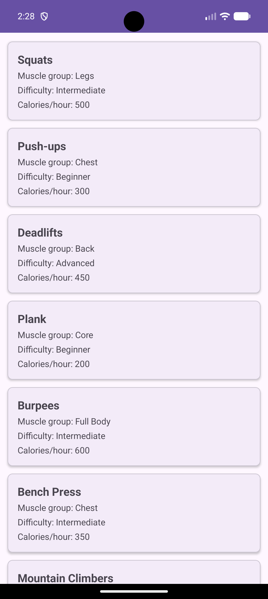
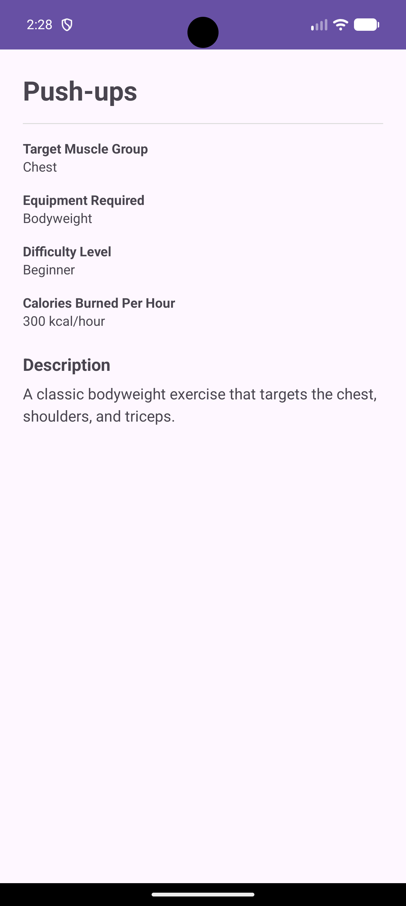

# 8156366Assignment2 — NIT3213 Mobile Application Development

An Android application built for the NIT3213 final assignment: a three-screen (Login → Dashboard → Details) app that authenticates against and consumes the `nit3213api`, built with Kotlin, MVVM + Repository architecture, Hilt dependency injection, and Retrofit/Moshi networking over coroutines.

---

## 1. Project Overview & Build Instructions

### App Overview

The app implements the three required screens as a single-Activity, multi-Fragment app navigated via the Jetpack Navigation Component:

1. **Login** (`LoginFragment` / `LoginViewModel`) — collects a student ID and first name, POSTs them to `/sydney/auth`, and on success receives a `keypass` used to scope the next screen.
2. **Dashboard** (`DashboardFragment` / `DashboardViewModel`) — GETs `/dashboard/{keypass}`, and displays the returned list of exercise entities in a `RecyclerView`, deliberately omitting each entity's `description` field from the summary view per the assignment's strict constraint.
3. **Details** (`DetailsFragment`) — receives the tapped `ExerciseEntity` via Navigation SafeArgs and displays every field, including the full `description` withheld from the Dashboard.

Navigation back-stack behaviour is intentional: Login → Dashboard clears the back stack (so the back button exits rather than returning to a completed login), while Dashboard → Details preserves it (so the back button returns to the already-loaded list without a network refetch).

## Screenshots

| Login | Dashboard | Details |
|---|---|---|
|  |  |  |

### Prerequisites

> **Note on tooling versions:** during development, this project's installed Android Studio came bundled with a Gradle/AGP release newer than what's commonly assumed in course material. The versions below are what this project *actually* requires to build — not the "Iguana/Jellyfish"-era tooling sometimes referenced in older guides, which predates the Gradle/AGP versions this project's `build.gradle.kts` files pin.

- **Android Studio**: a release bundling **Gradle 9.6** and **Android Gradle Plugin (AGP) 9.4** or newer (check **Help → About** in Android Studio, or `gradle/wrapper/gradle-wrapper.properties` for the exact Gradle version this project expects).
- **JDK 17** (Android Studio's bundled JDK satisfies this; confirm under **Settings → Build Tools → Gradle → Gradle JDK**).
- **Minimum SDK**: API 24
- **Target / Compile SDK**: API 34
- An internet connection (for Gradle dependency resolution and for the app itself to reach `https://nit3213apinew.onrender.com/`).

### Build & Run Instructions

1. Clone or extract the project, then open the root folder in Android Studio (**File → Open**) and let the initial Gradle sync complete.
2. Select a device or emulator from the toolbar dropdown and click **Run ▶**, or from the command line:
   ```bash
   # macOS / Linux
   ./gradlew installDebug

   # Windows
   gradlew.bat installDebug
   ```
3. To run the unit test suite (`LoginViewModelTest`, `DashboardViewModelTest`) from the command line:
   ```bash
   # macOS / Linux
   ./gradlew test

   # Windows
   gradlew.bat test
   ```
   Results are written to `app/build/reports/tests/testDebugUnitTest/index.html`.

---

## 2. Architecture & Dependency Injection

### MVVM + Repository Pattern

The app follows the layered architecture taught across NIT3213 Weeks 3–8:

- **UI layer (Fragments)** — `LoginFragment`, `DashboardFragment`, `DetailsFragment` inflate layouts, forward user actions to their ViewModel, and render UI state via `StateFlow.collect` inside `repeatOnLifecycle(Lifecycle.State.STARTED)`. Fragments hold no business logic and make no direct network calls.
- **ViewModel layer** — `LoginViewModel` and `DashboardViewModel` (both `@HiltViewModel`) hold UI state as a sealed class (`LoginUiState`, `DashboardUiState` — `Idle`/`Loading`/`Success`/`Error`) exposed as a read-only `StateFlow`, and launch repository calls inside `viewModelScope`. `DetailsFragment` has no ViewModel, since its data arrives complete via Navigation SafeArgs and requires no asynchronous work.
- **Repository layer** — `AppRepository` is the single source of truth for network-backed data. It wraps every `ApiService` call in a `Result<T>`, converting HTTP failures and exceptions into a single, ViewModel-friendly type so no other layer needs to know about `Response<T>`, `HttpException`, or raw exceptions.
- **Network / data layer** — `ApiService` (a Retrofit interface) defines the two endpoints (`POST sydney/auth`, `GET dashboard/{keypass}`); `LoginRequest`, `LoginResponse`, `ExerciseEntity`, and `DashboardResponse` are the Moshi-mapped data classes representing request/response bodies.

This mirrors the app-architecture diagram from the Week 3–4 material: Fragment → ViewModel → Repository → ApiService → Server, with data flowing back up the same chain.

### Hilt Dependency Injection

Per the Dependency Injection lesson (Lesson 7), the app uses Hilt throughout rather than manually constructing dependencies:

- **`@HiltAndroidApp`** — applied to `AssignmentApplication`, the application class, triggering Hilt's code generation and establishing the app-wide dependency graph.
- **`@AndroidEntryPoint`** — applied to every Android framework class that receives injected dependencies: `MainActivity`, `LoginFragment`, `DashboardFragment`, and `DetailsFragment`.
- **`@Module` + `@InstallIn(SingletonComponent::class)`** — `NetworkModule` is where dependencies that can't be constructor-injected (Retrofit, OkHttp, Moshi — all third-party types) are defined.
- **`@Provides` + `@Singleton`** — each function inside `NetworkModule` (`provideMoshi`, `provideOkHttpClient`, `provideRetrofit`, `provideApiService`) tells Hilt exactly how to build that dependency, and scopes it to a single app-wide instance.
- **`@Inject constructor(...)`** — used on `AppRepository` and both ViewModels so Hilt can construct them automatically, resolving `ApiService`/`AppRepository` from the graph without any class needing a manual `RetrofitClient()`-style singleton of its own.
- **`@HiltViewModel`** — marks `LoginViewModel` and `DashboardViewModel` so Hilt manages their lifecycle correctly when retrieved via the `by viewModels()` delegate.

Annotation processing runs through **KSP** rather than `kapt` (`ksp("com.google.dagger:hilt-android-compiler:...")`), matching current Hilt/AGP guidance rather than the older `kotlin-kapt`-based setup shown in some course slides.

### Network Layer (Retrofit + Moshi + Coroutines)

- **Retrofit** defines the API surface declaratively (`ApiService`), with `suspend fun` endpoints that integrate directly with Kotlin coroutines rather than requiring callback-based `Call<T>` handling.
- **Moshi**, via `KotlinJsonAdapterFactory`, handles JSON (de)serialization into the Kotlin data classes (`LoginResponse`, `DashboardResponse`, `ExerciseEntity`) without hand-written parsing code.
- **`viewModelScope`** is used for every network-triggering coroutine in both ViewModels, which ties each in-flight request to that ViewModel's lifecycle — if the user navigates away and the ViewModel is cleared, any pending coroutine is cancelled automatically, consistent with the Asynchronicity & Networking lesson's coverage of coroutine scopes.
- An `HttpLoggingInterceptor` (level `BODY`) is wired into the shared `OkHttpClient` for debugging request/response payloads during development.

---

## 3. Academic References

Victoria University. (2025). *NIT3213 final assignment specification: Android application development project* [Assignment brief]. Victoria University, Melbourne.

Victoria University. (2025). *NIT3213 Week 3–4: Important topics & concepts — Android app architecture, repository pattern, and dependency injection* [Lecture slides]. Victoria University, Melbourne.

Victoria University. (2025). *NIT3213 Lesson 4: Clean code principles & navigation component* [Lecture slides]. Victoria University, Melbourne.

Victoria University. (2025). *NIT3213 Lesson 5: Asynchronicity & networking — Coroutines, StateFlow, and Retrofit* [Lecture slides]. Victoria University, Melbourne.

Victoria University. (2025). *NIT3213 Lesson 6: RecyclerView implementation — Adapters and ViewHolders* [Lecture slides]. Victoria University, Melbourne.

Victoria University. (2025). *NIT3213 Lesson 7: Dependency injection — Dagger/Hilt framework* [Lecture slides]. Victoria University, Melbourne.

Victoria University. (2025). *NIT3213 Lesson 8: Testing & verification — Unit testing, JUnit, MockK, and coroutines test* [Lecture slides]. Victoria University, Melbourne.

Google. (n.d.). *Android Developers documentation*. https://developer.android.com

JetBrains. (n.d.). *Kotlinx.coroutines documentation*. https://kotlinlang.org/api/kotlinx.coroutines/

Square, Inc. (n.d.). *Retrofit: A type-safe HTTP client for Android and Java*. https://square.github.io/retrofit/

Square, Inc. (n.d.). *Moshi: A modern JSON library for Kotlin and Java*. GitHub. https://github.com/square/moshi

*Note: update the year above to match the actual teaching period this unit was undertaken in, and add a VU Collaborate/unit-site URL if your school requires a retrievable link for lecture materials.*

---

## 4. Academic Integrity & Generative AI Declaration

In preparing this assignment, a generative AI assistant (Anthropic's Claude) was used as a development aid in accordance with Victoria University's guidelines on the ethical use of generative AI in assessment. Specifically, AI assistance was used to:

- Scaffold boilerplate Android/Kotlin code (data classes, Retrofit interfaces, Hilt modules, ViewModels, adapters, and navigation graphs) based on patterns taught in the NIT3213 lecture materials referenced above.
- Diagnose and resolve Gradle/Android Gradle Plugin build-configuration issues encountered during setup (Gradle wrapper version compatibility, migration to AGP's built-in Kotlin support, and migrating Hilt's annotation processing from `kapt` to `KSP`).
- Draft unit test structures using JUnit, MockK, and kotlinx-coroutines-test.
- Draft and format this README, including its architecture explanation and reference list.

All AI-assisted code, configuration, and documentation was reviewed, tested, and adapted by the student, who takes full responsibility for the final submitted work, its correctness, and its originality. No AI tool was used to generate assessment answers on the student's behalf beyond the drafting/scaffolding/debugging assistance described above, and all external sources of concepts, patterns, and library usage have been credited in the References section.